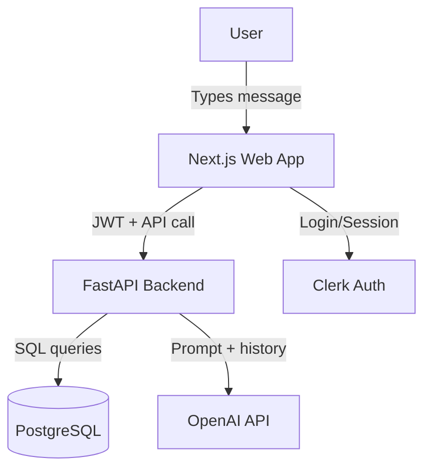
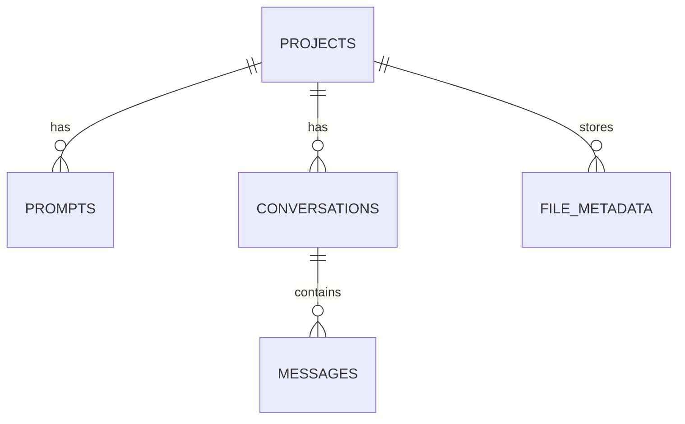

# Architecture & Design Guide

## Big‑Picture Analogy (Non‑Technical)
Think of the system like a **restaurant**:

- **Frontend (Next.js)** is the **waiter** taking your order (your message).
- **Backend API (FastAPI)** is the **kitchen** that prepares the meal (routes and processes requests).
- **Database (PostgreSQL)** is the **recipe book** and **order history** (stores projects, prompts, and chats).
- **OpenAI** is the **chef** who actually cooks the response.
- **Clerk** is the **host** who checks your reservation (login).

---

## System Context Diagram (Mermaid)

---

## Core Components (What Each Part Does)

### 1) Frontend (Next.js)
- Captures user input in the chat UI.
- Sends requests to the API using a **JWT** (a signed “ticket” proving who you are).
- Streams AI responses in real time using **SSE** (a one‑way live text stream from server to browser).

### 2) Backend API (FastAPI)
- Receives requests at `/api/...` routes.
- Verifies the Clerk JWT and extracts `user_id`.
- Loads the active system prompt and past messages.
- Calls the OpenAI Responses API and streams output back to the browser.
- Saves messages and metadata to the database.

### 3) Database (PostgreSQL)
Stores data with clear relationships:

- **projects**: top‑level containers for a user’s chatbot.
- **prompts**: system prompts tied to a project (only one active).
- **conversations**: a chat session under a project.
- **messages**: individual chat turns (user or assistant).
- **file_metadata**: file uploads linked to a project and user.

This relational layout keeps data consistent and easy to query.

### 4) LLM Integration (OpenAI)
- The backend uses the **OpenAI Responses API**.
- It sends the **system prompt** + **conversation history** to the model.
- It streams tokens (small pieces of text) back to the user as they’re generated.

---

## Key Design Decisions (And Why)

- **Authentication with Clerk + JWT**
  - **Why:** Offloads password/security work to a trusted provider.
  - **Benefit:** The backend only needs to verify JWT signatures.

- **PostgreSQL with SQLAlchemy**
  - **Why:** Data has strong relationships (projects → conversations → messages).
  - **Benefit:** Relational databases are reliable for linked data.

- **Server‑Sent Events (SSE) for streaming**
  - **Why:** Works well for one‑direction streaming (server → browser).
  - **Benefit:** Simple to implement and compatible with most browsers.

- **OpenAI calls from the backend only**
  - **Why:** Keeps API keys secret and prevents abuse from the client side.
  - **Benefit:** Better security and centralized usage control.

---

## Data Flow: One Chat Message (Step‑By‑Step)

1. **User types a message** in the web UI.
2. **Frontend sends the message** to the backend with a Clerk JWT.
3. **Backend verifies the JWT** and gets the `user_id`.
4. **Backend fetches** the active system prompt + conversation history.
5. **Backend calls OpenAI** with those inputs.
6. **OpenAI streams tokens** back to the backend.
7. **Backend forwards tokens** to the frontend using SSE.
8. **Frontend renders tokens** as live text in the chat window.
9. **Backend stores the final messages** (user + assistant) in PostgreSQL.

---

## Data Model Snapshot (Simple View)

---

## Where to Learn More
- **Run the app:** See `README.md`.
- **API docs:** http://localhost:8000/docs (when running locally).
